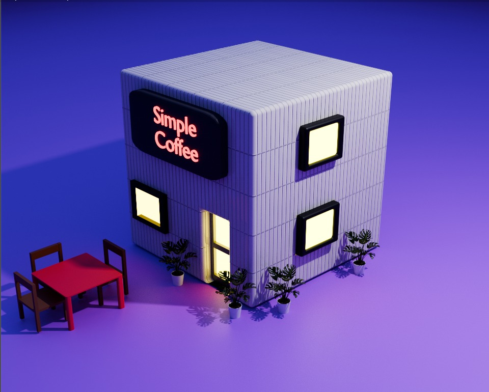

<div align="center">



# RONNIE CELIS

### Frontend Developer • 3D Artist • Creative Coder

Building immersive digital experiences through modern web development and cinematic 3D design.

<br>


</div>

---

# ABOUT

I focus on creating visually engaging digital experiences combining frontend development, UI design, and 3D art.

My work blends:
- Modern Web Interfaces
- Interactive Frontend Experiences
- Blender Modeling & Rendering
- Creative Development
- Experimental Visual Design

---

# FEATURED PROJECTS

<table>
<tr>
<td width="50%">

## Furniture Store

Modern furniture ecommerce interface focused on clean layouts and responsive design.

<a href="https://ronie-celis-tiendamuebles.netlify.app" target="_blank">

</a>

</td>

<td width="50%">

## Architecture Landing

Architecture-inspired landing page with modern visual composition.

<a href="https://arquitecturaforlive-zfyt.vercel.app/" target="_blank">

</a>

</td>
</tr>

<tr>
<td width="50%">

## Interactive Experience

Experimental interactive web interface exploring animation and visual interaction.

<a href="https://vocal-klepon-31d4c2.netlify.app" target="_blank">

</a>

</td>

<td width="50%">

## Blender & 3D

Cinematic modeling, rendering, lighting and visual experimentation using Blender.

</td>
</tr>
</table>

---

# TECH STACK

<div align="center">


</div>

---

# CREATIVE WORKFLOW

```txt
Design → Prototype → Develop → Animate → Render → Refine
